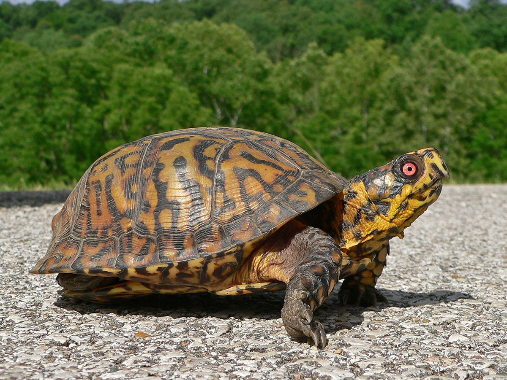

```{r setup, include=FALSE}
knitr::opts_chunk$set(echo = TRUE)

```

# Introduction

## 배경 Background

지금까지 다변량 분석과 공간적 자기상관성, Geostatistics에 대해 공부했다.  
이번 학습 목표는 종 분포 모형, 기계학습에서의 공간적 자기상관성이다.  


### 연구 절차
연구 절차는 다음의 단계로 이루어진다.  

1. __탐색적 자료 분석__   
데이터를 전처리하고 시각화하여 데이터의 특징을 살펴봄.  
PCA, t-SNE, UMAP을 통해 수집한 포인트 데이터와 환경 변수의 관계를 확인, 연구 방법 계획.  

2. __모델 구성__   
모델에 투입되는 자료의 특성을 반영해 Feature를 조작.  
이후 모델 결과를 살펴보며 변수를 조절.  

3. __최종 모델 평가__  
공간적 자기상관성의 분포와 feature 조작이 모델에 어떻게 나타났는지 확인.  

4. __모델 해석__   
공간적 자기상관성의 의미와 종 특성과 연관지어 해석.  

5. __토론__  
모델이 부족한 점과 이에 대한 디펜스  

6. __추가 연구__   
더 공부해봄 직한 것들.  


### 공간 통계에의 공간적 자기 상관성 Spatial Autocorrelation in spatial statistics

### 기계학습에서의 공간적 자기상관성 Spatial Autocorrelation in ML

### 종 분포 모형에서의 공간적 자기상관성 Spatial Autocorrelation in SDM

## 데이터 전처리 Data wrangling


```{r parallel computing, eval=FALSE, include=FALSE}
library(parallel) #parallel computing
library(foreach)
library(doParallel)
library(doSNOW)
library(furrr)

cores <- parallel::detectCores() - 1
cluster <- parallel::makeCluster(spec = cores)
doParallel::registerDoParallel(cl = cluster)
future::plan(multisession)
stopCluster()

```

본 연구는 주요 척추동물 분류군 포유류, 파충류, 양서류, 조류 총 400여 종에 대한 분석을 실시한다.
각 종당 1000개의 공간 포인트를 가지며 각 종당 모델링은 8개의 환경 래스터 파일을 사용한다.
데이터 분석의 양이 많으므로 병렬 컴퓨팅이 빠른 분석을 위해 필수적이다.

```{r package library, eval=FALSE, comment=, include=FALSE}
#----------------------------
# packages
#----------------------------
library(spocc)
library(gbm)
library(stars)
library(sf)
library(sp)
library(MicroNiche)
library(ggplot2)
library(rgbif)
library(tidyverse)
library(rJava)
library(vegan)
library(dismo)
library(tidymodels)
library(ggcorrplot)
library(FactoMineR)
library(factoextra)
library(furrr)
library(listviewer)
library(tictoc)
library(corrr)
library(mapr)
```

```{r get/set directroy, eval=FALSE, include=FALSE}
#----------------------------
# get/set directory
#----------------------------
jadeDir <- "G:/내 드라이브/졸업논문/wrangling"

desktopDir <- "E:/residual_sdm"
desktopRmdDir <- "E:/residualsofsdm"

gitprojDir <- "C:/Users/Jeon/Documents/residualsofsdm"

setwd(jadeDir)

setwd(desktopDir)

setwd(desktopRmdDir)

setwd(gitprojDir)

getwd()

```

```{r read csv OPTION 1. species_taxon_gbif.csv(TAXON FAMILY TREE), eval=FALSE, include=FALSE}
#----------------------------
# read target species list-op1
#----------------------------
specieslist_mammal<- readr::read_csv("species_mammal_gbif.csv", col_names = T, skip = 1)
list_origin_mammal <- specieslist_mammal[!specieslist_mammal=='']

specieslist_reptile<- readr::read_csv("species_reptile_gbif.csv", col_names = T, skip = 1)
list_origin_reptile <- specieslist_reptile[!specieslist_reptile=='']

specieslist_amphibian<- readr::read_csv("species_amphibia_gbif.csv", col_names = T, skip = 1)
list_origin_amphibian <- specieslist_amphibian[!specieslist_amphibian=='']

specieslist_aves<- readr::read_csv("species_aves_gbif.csv", col_names = T, skip = 1)
list_origin_aves <- specieslist_aves[!specieslist_aves=='']
```

```{r read csv OPTION 2. species_taxon.csv(JUST TAXON KEY n SPECIES COLUMM)}
#----------------------------
# read target species list-op2
#----------------------------
specieslist_mammal<- readr::read_csv("species_MAMMAL.csv", col_names = T)
list_origin_mammal <- specieslist_mammal$scientificName

specieslist_reptile<- readr::read_csv("species_REPTILE.csv", col_names = T)
list_origin_reptile <- specieslist_reptile$scientificName

specieslist_amphibian<- readr::read_csv("species_AMPHIBIAN.csv", col_names = T)
list_origin_amphibian <- specieslist_amphibian$scientificName

specieslist_aves<- readr::read_csv("species_AVES.csv", col_names = T)
list_origin_aves <- specieslist_aves$scientificName

```

```{r etc. taxon key, eval=FALSE, include=FALSE}
#Get taxon key to use rgbif
csv_AVES <- readr::read_csv("species_AVES.csv")
taxon_AVES <- as.vector(csv_AVES$taxon_key)

csv_MAMMALIA <- readr::read_csv("species_MAMMALIA.csv")
taxon_MAMMAL <- as.vector(csv_MAMMALIA$taxon_key)

csv_REPTILE <- readr::read_csv("species_REPTILE.csv")
taxon_REPTILE <- as.vector(csv_REPTILE$taxon_key)

csv_AMPHIBIAN <- readr::read_csv("species_AMPHIBIAN.csv")
taxon_AMPHIBIAN <- as.vector(csv_AMPHIBIAN$taxon_key)

for (i in taxon_AVES){AVES <- occ_download(pred("taxonKey", i), pred("hasCoordinate", TRUE))} #3limit
```

```{r etc. rgbif::occ_download, eval=FALSE, include=FALSE}
#----------------------------
# GET OCCURENCE DATA FROM GBIF
#---------------------------- 
AVES <- occ_download(pred("taxonKey", taxon_AVES), pred("hasCoordinate", TRUE))
AMPHIBIA <- occ_download(pred("taxonKey", 131), pred("hasCoordinate", TRUE))
MAMMAL <- occ_download(pred("taxonKey", 359), pred("hasCoordinate", TRUE))
REPTILE <- occ_download(pred("taxonKey", 358), pred("hasCoordinate", TRUE))

ARACHNIDA <- occ_download(pred("taxonKey", 367), pred("hasCoordinate", TRUE))
INSECTA <- occ_download(pred("taxonKey", 216), pred("hasCoordinate", TRUE))
Malacostraca <- occ_download(pred("taxonKey", 229), pred("hasCoordinate", TRUE))
CHILOPODA <- occ_download(pred("taxonKey", 360), pred("hasCoordinate", TRUE))

gbif_mammal<- occ_download(pred("scientificName", 'Ursus americanus'), pred('hasCoordinate', TRUE), format = 'simple_csv')
gbif_mammal2 <- occ_download_datasets("0128483-200613084148143", limit = 1000, start = 1)

gbif_mammal<- occ_download(pred_in("scientificName", list_origin_mammal), pred('hasCoordinate', TRUE))
occ_download_get("0128483-200613084148143", path = "F:/residual_sdm", overwrite = T)
occ_download_get("0128483-200613084148143", path = "F:/residual_sdm", overwrite = T)
```

```{r etc. rgbif::occ_data, eval=FALSE, include=FALSE}
OCCDATA_AVES <- occ_data(taxonKey = taxon_AVES, hasCoordinate = T, limit = 100000, hasGeospatialIssue = F)
OCCDATA_MAMMAL <- occ_data(taxonKey = taxon_MAMMAL, hasCoordinate = T, limit = 100000, hasGeospatialIssue = F)
OCCDATA_REPTILE <- occ_data(taxonKey = taxon_REPTILE, hasCoordinate = T, limit = 100000, hasGeospatialIssue = F)
OCCDATA_AMPHIBIAN <- occ_data(taxonKey = taxon_AMPHIBIAN, hasCoordinate = T, limit = 100000, hasGeospatialIssue = F)

issue ="ZERO_COORDINATE","COORDINATE_REPROJECTED", "COORDINATE_REPROJECTION_SUSPICIOUS","PERSUMED_NEGATED_LATITUDE","PERSUMED_NEGATED_LONGITUDE","PERSUMED_SWAPPED_COORDINATE","RECORDED_DATE_INVALID","RECORDED_DATE_UNLIKELY","TAXON_MATCH_HIGHERRANK",
"TAXON_MATCH_NONE"

```

```{r spocc::occ get occurrence}
tic("mammal_occ") #326.45 sec elapsed
out_mammal <- occ(query = list_origin_mammal ,from = "gbif", limit = 1000, has_coords= T)  
toc()
tic("retile_occ") #672.14 sec elapsed
out_reptile <- occ(query = list_origin_reptile, from = 'gbif', limit = 1000, has_coords= T)  
toc()
tic("amphibian_occ") # 326.06 sec elapsed
out_amphibian <- occ(query = list_origin_amphibian, from = 'gbif', limit = 1000, has_coords= T)
toc()
tic("aves_occ") #653.15 sec elapsed
out_aves <- occ(query = list_origin_aves, from = 'gbif', limit = 1000, has_coords = T)
toc()
```


```{r mapping occurences with mapr::mapggplot}
map(out_reptile$gbif$data, map_ggplot)
```
```{r mapping occurences with mapr::mapggplot}
map(out_aves$gbif$data, map_ggplot)
```


```{r}
mapr::map_ggplot(out_reptile$gbif$data$Terrapene_carolina, map = "usa", size = 1)
```


```{r save out_data}
selectuseful <- function(x){dplyr::select(x, 1:62)}

out_mammal_names <- paste0("E:/out/mammal/out_", list_origin_mammal, ".csv")
out_mammal_forsave <- map(out_mammal$gbif$data, selectuseful) 
map2(out_mammal_forsave, out_mammal_names, write_csv)

out_reptile_names <- paste0("E:/out/reptile/out_", list_origin_reptile, ".csv")
out_reptile_forsave <- map(out_reptile$gbif$data, selectuseful) 
map2(out_reptile_forsave, out_reptile_names, write_csv)

out_amphibian_names <- paste0("E:/out/amphibian/out_", list_origin_amphibian, ".csv")
out_amphibian_forsave <- map(out_amphibian$gbif$data, selectuseful) 
map2(out_amphibian_forsave, out_amphibian_names, write_csv)

out_aves_names <- paste0("E:/out/aves/out_", list_origin_aves, ".csv")
out_aves_forsave <- map(out_aves$gbif$data, selectuseful) 
map2(out_aves_forsave, out_aves_names, write_csv)


```


```{r cbind longlat}
list_longlat_mammal <- rep(list('empty'), length(1))
for (i in 1:length(1)){
  list_longlat_mammal[[i]] <- sapply(
    out_mammal$gbif$data,
    function(x){
      cbind(x[,2:3])
      })
}

list_longlat_reptile <- rep(list('empty'), length(1))
for (i in 1:length(1)){
  list_longlat_reptile[[i]] <- sapply(
    out_reptile$gbif$data,
    function(x){
      cbind(x[,2:3])
      })
}

list_longlat_amphibian <- rep(list('empty'), length(1))
for (i in 1:length(1)){
  list_longlat_amphibian[[i]] <- sapply(
    out_amphibian$gbif$data,
    function(x){
      cbind(x[,2:3])
    })
}

list_longlat_aves <- rep(list('empty'), length(1))
for (i in 1:length(1)){
  list_longlat_aves[[i]] <- sapply(
    out_aves$gbif$data,
    function(x){
      cbind(x[,2:3])
    })
}
```


```{r convert list_longlat_taxon into data.frame}
data_frame_mammal <- lapply(list_longlat_mammal,data.frame)
list_xy_mammal <- data_frame_mammal[[1]]

data_frame_reptile <- lapply(list_longlat_reptile,data.frame)
list_xy_reptile <- data_frame_reptile[[1]]

data_frame_amphibian <- lapply(list_longlat_amphibian,data.frame)
list_xy_amphibian <- data_frame_amphibian[[1]]

data_frame_aves <- lapply(list_longlat_aves,data.frame)
list_xy_aves <- data_frame_aves[[1]]
```


```{r longlat to sp, spatial point object}

#----------------------------
# longlat to sp. sp::SpatialPoints
#----------------------------

list_spatial_mammal <- sapply(
list_xy_mammal,
function(x){
    SpatialPoints(x, proj4string=CRS("+proj=longlat +datum=WGS84"))
  }
)

list_spatial_reptile <- sapply(
  list_xy_reptile,
  function(x){
    SpatialPoints(x, proj4string=CRS("+proj=longlat +datum=WGS84"))
  }
)

list_spatial_amphibian <- sapply(
  list_xy_amphibian,
  function(x){
    SpatialPoints(x, proj4string=CRS("+proj=longlat +datum=WGS84"))
  }
)


list_spatial_aves <- sapply(
  list_xy_aves,
  function(x){
    SpatialPoints(x, proj4string=CRS("+proj=longlat +datum=WGS84"))
  }
)

```


```{r Spatial Points visualize with leaflet}

leaflet(list_xy_amphibian$Rana_temporaria) %>%
addTiles() %>%
addMarkers(lng=~longitude, lat=~latitude, clusterOptions = markerClusterOptions())

```


```{r}
bios <- paste0("E:/residual_sdm/", list.files(pattern="*.tif", path = "E:/residual_sdm"))
stackbio <- stack(bios)
```


```{r extract, eval=FALSE, include=FALSE}
#----------------------------
# extract bio + spatial points 
#----------------------------
tic("extract_mammal")
extract_spatial_mammal_lapply <- lapply(
  list_spatial_mammal,
  function(x){
    extract(stackbio, x)
  }
)
toc()

tic("extract_reptile")
extract_spatial_reptile_lapply <- lapply(
  list_spatial_reptile,
  function(x){
    extract(stackbio, x)
  }
)
toc()

tic("extract_amphibian")
extract_spatial_amphibian_lapply <- lapply(
  list_spatial_amphibian,
  function(x){
    extract(stackbio, x)
  }
)
toc()

tic("extract_aves")
extract_spatial_aves_lapply <- lapply(
  list_spatial_aves,
  function(x){
    extract(stackbio, x)
  }
)
toc()

```

```{r furrr::future_map for speedy extract, eval=FALSE, include=FALSE}
#Furrr::future_map for speedy extract
extracting_stackbio <- function(x) {extract(stackbio, x)}
pb <- progress::progress_bar$new(total = 100)
purrr::map(x, ~{pb$tick(); Sys.sleep(0.1)})


tic("extract_furrr_mammal")
extract_spatial_mammal_furrr <- furrr::future_map(.x = list_spatial_mammal, .f = extracting_stackbio)
toc()

tic("extract_furrr_reptile")
extract_spatial_reptile_furrr <- furrr::future_map(.x = list_spatial_reptile, .f = extracting_stackbio)
toc()

tic("extract_furrr_amphibian")
extract_spatial_amphibian_furrr <- furrr::future_map(.x = list_spatial_amphibian, .f = extracting_stackbio)
toc()

tic("extract_furrr_aves")
extract_spatial_aves_furrr <- furrr::future_map(.x = list_spatial_aves, .f = extracting_stackbio, .options = furrr_options(seed = T))
toc()
```

```{r save extracted values}

extract_mammal_names <- paste0("E:/extract/mammal/extract_", list_origin_mammal, ".csv")
extract_mammal_forsave <- map(extract_spatial_mammal_lapply, data.frame) 
map2(extract_mammal_forsave, extract_mammal_names, write_csv)

extract_reptile_names <- paste0("E:/extract/reptile/extract_", list_origin_reptile, ".csv")
extract_reptile_forsave <- map(extract_spatial_reptile_lapply, data.frame) 
map2(extract_reptile_forsave, extract_reptile_names, write_csv)


extract_aves_names <- paste0("E:/extract/aves/extract_", list_origin_aves, ".csv")
extract_aves_forsave <- map(extract_spatial_aves_furrr, data.frame) 
map2(extract_aves_forsave, extract_aves_names, write_csv)


```


so, let's check the extracted results.
How much NAs? What's their range? What's different with standardize?

1. NAs
```{r NAs Check}
a <- map(top4_pc1_amphibian_sd, as.tibble)
b <- map(top4_pc1_amphibian, as.tibble)
map2(a,b, all_equal)

a<- function(x){sum(is.na(x))}


b<- standard_amphibian[[1]]
d <- na.omit(standard_amphibian)

a(d$Rana_temporaria)

map(standard_amphibian_naomit, a)

z <- na.omit(d$Rana_temporaria)

a(d) 

standard_amphibian_na <- map(standard_amphibian, na.omit)

```

Before proceed to visualize, We didn't standardized them.  
Let's make another standardized data set. 


```{r standardized extracted points values}
standard <- function(x){scale(x, center = T, scale = T)}

standard_amphibian <- extract_spatial_amphibian_lapply %>%  map(.f = scale(., center = T, scale = T))
standard_amphibian <- map(extract_spatial_amphibian_lapply, standard) 
standard_amphibian_df <- map(standard_amphibian, as.data.frame)


```


```{r PCA extracted points with FactoMineR::PCA }
#----------------------------
# PCA extracted points
#----------------------------
list_PCA_mammal <- lapply(
  extract_spatial_mammal_lapply,
  function(x){
    PCA(x)
  }
)

list_PCA_reptile <- lapply(
  extract_spatial_reptile_lapply,
  function(x){
    PCA(x)
  }
)

list_PCA_amphibian <- lapply(
  extract_spatial_amphibian_lapply,
  function(x){
    PCA(x)
  }
)

list_PCA_aves <- lapply(
  extract_spatial_aves_furrr,
  function(x){
    PCA(x)
  }
)

```


```{r PCA for the standardized extracted points value}
list_PCA_amphibian_standard <- lapply(
  standard_amphibian,
  function(x){
    PCA(x)
  }
)

```

```{r caculating niche breadth}
#----------------------------
# Niche breadth - 0.05 ~ 0.95
#----------------------------

cord_out_1 <- list()
cord_out_2 <- list()

for (i in seq_along(1:length(list_PCA_mammal))){
  cord_out_1[[i]] <- quantile(list_PCA_mammal[[i]]$ind$coord[,1], c(0.05, .95))
  cord_out_2[[i]] <- quantile(list_PCA_mammal[[i]]$ind$coord[,2], c(0.05, .95))
}

cord_mammal_df_pc1 <- do.call(rbind, cord_out_1)
cord_mammal_df_pc2 <- do.call(rbind, cord_out_2)
nb_mammal_pc1_df <- abs(cord_mammal_df_pc1[,1]) + cord_mammal_df_pc1[,2]
nb_mammal_pc2_df <- abs(cord_mammal_df_pc2[,2]) + cord_mammal_df_pc2[,2]
nb_mammal <- nb_mammal_pc1_df + nb_mammal_pc2_df 

##########################################################


cord_out_1 <- list()
cord_out_2 <- list()

for (i in seq_along(1:length(list_PCA_reptile))){
  cord_out_1[[i]] <- quantile(list_PCA_reptile[[i]]$ind$coord[,1], c(0.05, .95))
  cord_out_2[[i]] <- quantile(list_PCA_reptile[[i]]$ind$coord[,2], c(0.05, .95))
}

cord_reptile_df_pc1 <- do.call(rbind, cord_out_1)
cord_reptile_df_pc2 <- do.call(rbind, cord_out_2)
nb_reptile_pc1_df <- abs(cord_reptile_df_pc1[,1]) + cord_reptile_df_pc1[,2]
nb_reptile_pc2_df <- abs(cord_reptile_df_pc2[,2]) + cord_reptile_df_pc2[,2]
nb_reptile <- nb_reptile_pc1_df + nb_reptile_pc2_df

##########################################################

cord_out_1 <- list()
cord_out_2 <- list()
# A for loop to extract the quantiles and same
for (i in seq_along(1:length(list_PCA_amphibian))){
  cord_out_1[[i]] <- quantile(list_PCA_amphibian[[i]]$ind$coord[,1], c(0.05, .95))
  cord_out_2[[i]] <- quantile(list_PCA_amphibian[[i]]$ind$coord[,2], c(0.05, .95))
}

# Create two corresponding DF's
cord_amphibian_df_pc1 <- do.call(rbind, cord_out_1)
cord_amphibian_df_pc2 <- do.call(rbind, cord_out_2)
nb_amphibian_pc1_df <- abs(cord_amphibian_df_pc1[,1]) + cord_amphibian_df_pc1[,2]
nb_amphibian_pc2_df <- abs(cord_amphibian_df_pc2[,2]) + cord_amphibian_df_pc2[,2]
nb_amphibian <- nb_amphibian_pc1_df + nb_amphibian_pc2_df 

##########################################################

cord_out_1 <- list()
cord_out_2 <- list()
# A for loop to extract the quantiles and same
for (i in seq_along(1:length(list_PCA_aves))){
  cord_out_1[[i]] <- quantile(list_PCA_aves[[i]]$ind$coord[,1], c(0.05, .95))
  cord_out_2[[i]] <- quantile(list_PCA_aves[[i]]$ind$coord[,2], c(0.05, .95))
}

# Create two corresponding DF's
cord_aves_df_pc1 <- do.call(rbind, cord_out_1)
cord_aves_df_pc2 <- do.call(rbind, cord_out_2)
nb_aves_pc1_df <- abs(cord_aves_df_pc1[,1]) + cord_aves_df_pc1[,2]
nb_aves_pc2_df <- abs(cord_aves_df_pc2[,2]) + cord_aves_df_pc2[,2]
nb_aves <- nb_aves_pc1_df + nb_aves_pc2_df 

##########################################################
```

```{r niche breadth with standardzied}
#----------------------------
# Niche breadth with standardized 
#----------------------------

cord_out_1 <- list()
cord_out_2 <- list()

for (i in seq_along(1:length(list_PCA_amphibian_standard))){
  cord_out_1[[i]] <- quantile(list_PCA_amphibian_standard[[i]]$ind$coord[,1], c(0.05, .95))
  cord_out_2[[i]] <- quantile(list_PCA_amphibian_standard[[i]]$ind$coord[,2], c(0.05, .95))
}

cord_amphibian_df_pc1_sd <- do.call(rbind, cord_out_1)
cord_amphibian_df_pc2_sd <- do.call(rbind, cord_out_2)
nb_amphibian_pc1_df_sd <- abs(cord_amphibian_df_pc1_sd[,1]) + cord_amphibian_df_pc1_sd[,2]
nb_amphibian_pc2_df_sd <- abs(cord_amphibian_df_pc2_sd[,2]) + cord_amphibian_df_pc2_sd[,2]
nb_amphibian_sd <- nb_amphibian_pc1_df_sd + nb_amphibian_pc2_df_sd

```

Do really nb is different with taxons?

```{r save nb}
nb_aves_df <- data.frame(nb_aves)
nb_reptile_df <- data.frame(nb_reptile)
nb_mammal_df <- data.frame(nb_mammal)

write_csv(nb_aves_df, "E:/nichebreadth/nb_aves_df.csv")
write_csv(nb_reptile_df, "E:/nichebreadth/nb_reptile_df.csv")
write_csv(nb_mammal_df, "E:/nichebreadth/nb_mammal_df.csv")

```

```{r TOP 4 PCA Variables Visualize}
pca_var_g <- fviz_pca_var(pkmon_pca, select.var = list(cos2 = 0.5), repel = TRUE)

sweep(list_PCA_mammal$Peromyscus_maniculatus$var$coord,2,sqrt(list_PCA_mammal$Peromyscus_maniculatus$eig[1:ncol(list_PCA_mammal$Peromyscus_maniculatus$var$coord),1]),FUN="/")

pcm1 <- PCA(m1bio)
pca_var_contrib <- factoextra::fviz_pca_var(pcm1, select.var = list(contrib = 3), repel = TRUE)

```

```{r TOP 4 PCA Variables}
top4_pc1_mammal <- list()
top4_pc2_mammal <- list()
for (i in seq_along(1:length(list_PCA_mammal))){
 top4_pc1_mammal[[i]] <- names(tail(sort(list_PCA_mammal[[i]]$var$cos2[,1]), 4))
 top4_pc2_mammal[[i]] <- names(tail(sort(list_PCA_mammal[[i]]$var$cos2[,2]), 4))
}

top4_pc1_reptile <- list()
top4_pc2_reptile <- list()
for (i in seq_along(1:length(list_PCA_reptile))){
  top4_pc1_reptile[[i]] <- names(tail(sort(list_PCA_reptile[[i]]$var$cos2[,1]), 4))
  top4_pc2_reptile[[i]] <- names(tail(sort(list_PCA_reptile[[i]]$var$cos2[,2]), 4))
}

top4_pc1_amphibian <- list()
top4_pc2_amphibian <- list()
for (i in seq_along(1:length(list_PCA_amphibian))){
  top4_pc1_amphibian[[i]] <- names(tail(sort(list_PCA_amphibian[[i]]$var$cos2[,1]), 4))
  top4_pc2_amphibian[[i]] <- names(tail(sort(list_PCA_amphibian[[i]]$var$cos2[,2]), 4))
}

top4_pc1_aves <- list()
top4_pc2_aves <- list()
for (i in seq_along(1:length(list_PCA_aves))){
  top4_pc1_aves[[i]] <- names(tail(sort(list_PCA_aves[[i]]$var$cos2[,1]), 4))
  top4_pc2_aves[[i]] <- names(tail(sort(list_PCA_aves[[i]]$var$cos2[,2]), 4))
}

```

```{r TOP 4 PCA standardized variables}
##################### 
# TOP 4 PCA standardized 
######################
top4_pc1_amphibian_sd <- list()
top4_pc2_amphibian_sd <- list()
for (i in seq_along(1:length(list_PCA_amphibian_standard))){
  top4_pc1_amphibian_sd[[i]] <- names(tail(sort(list_PCA_amphibian_standard[[i]]$var$cos2[,1]), 4))
  top4_pc2_amphibian_sd[[i]] <- names(tail(sort(list_PCA_amphibian_standard[[i]]$var$cos2[,2]), 4))
}

```

```{r stacking rasters }

paste2 <- function(x){paste(x, ".tif", sep = "")}


######################################################
top4_pc1_mammal.tif <- top4_pc1_mammal %>% map(paste2)
top4_pc2_mammal.tif <- top4_pc2_mammal %>% map(paste2)

top4_pc2_mammal.tif.stack <- top4_pc2_mammal.tif %>% map(stack)
top4_pc1_mammal.tif.stack <- top4_pc1_mammal.tif %>% map(stack)
top4_pc12_mammal.stack <- map2(top4_pc1_mammal.tif.stack, top4_pc2_mammal.tif.stack, stack)

##############################################################################
top4_pc1_reptile.tif <- top4_pc1_reptile %>% map(paste2)
top4_pc2_reptile.tif <- top4_pc2_reptile %>% map(paste2)

top4_pc2_reptile.tif.stack <- top4_pc2_reptile.tif %>% map(stack)
top4_pc1_reptile.tif.stack <- top4_pc1_reptile.tif %>% map(stack)
top4_pc12_reptile.stack <- map2(top4_pc1_reptile.tif.stack, top4_pc2_reptile.tif.stack, stack)

##############################################################################
top4_pc1_amphibian.tif <- top4_pc1_amphibian %>% map(paste2)
top4_pc2_amphibian.tif <- top4_pc2_amphibian %>% map(paste2)

top4_pc2_amphibian.tif.stack <- top4_pc2_amphibian.tif %>% map(stack)
top4_pc1_amphibian.tif.stack <- top4_pc1_amphibian.tif %>% map(stack)
top4_pc12_amphibian.stack <- map2(top4_pc1_amphibian.tif.stack, top4_pc2_amphibian.tif.stack, stack)

##############################################################################
top4_pc1_aves.tif <- top4_pc1_aves %>% map(paste2)
top4_pc2_aves.tif <- top4_pc2_aves %>% map(paste2)

top4_pc2_aves.tif.stack <- top4_pc2_aves.tif %>% map(stack)
top4_pc1_aves.tif.stack <- top4_pc1_aves.tif %>% map(stack)
top4_pc12_aves.stack <- map2(top4_pc1_aves.tif.stack, top4_pc2_aves.tif.stack, stack)

```

```{r get the extent}
#extent 
extent_mammal <- map(list_spatial_mammal, extent)
extent_reptile <- map(list_spatial_reptile, extent)
extent_amphibian <- map(list_spatial_amphibian, extent)
extent_aves <- map(list_spatial_aves, extent)
```

```{r}
#----------------------------
#raster crop to save times
#----------------------------

tic("mammal_bios") #mammal_bios: 5026.39 sec elapsed
mammal_bios <- furrr::future_map2(top4_pc12_mammal.stack, extent_mammal, crop)
toc()

tic("reptile_bios") #reptile_bios: 2834.84 sec elapsed
reptile_bios <- furrr::future_map2(top4_pc12_reptile.stack, extent_reptile, crop)
toc()

tic("amphibian_bios") #amphibian_bios: 762.35 sec elapsed
amphibian_bios <- furrr::future_map2(top4_pc12_amphibian.stack, extent_amphibian, crop)
toc()

tic("aves_bios") #aves_bios: 3765.14 sec elapsed
aves_bios <- furrr::future_map2(top4_pc12_aves.stack, extent_aves, crop)
toc()


```


```{r save raster}

reptile_bios %>% furrr::future_map2(paste0("J:/reptile_bios_", list_origin_reptile,".gri"), writeRaster)

amphibian_bios %>% furrr::future_map2(paste0("J:/amphibian_bios_", list_origin_amphibian,".gri"), writeRaster)

aves_bios %>% 
furrr::future_map2(paste0("J:/aves_bios_", list_origin_aves,".gri"), writeRaster)

```

```{r read saved rasters}

bios_mammal <- list.files(path = "J:/", pattern="*.gri")
bios_mammal <- paste0("J:/mammal_bios_", list_origin_mammal, ".gri")
bios_mammal <- map(bios_mammal, brick)

bios_amphibian <- list.files(path = "J:/", pattern="*.gri")
bios_amphibian <- paste0("J:/amphibian/amphibian_bios_", list_origin_amphibian, ".gri")
bios_amphibian <- map(bios_amphibian, brick)

bios_aves <- list.files(path = "J:/", pattern="*.gri")
bios_aves <- paste0("J:/aves_bios_", list_origin_aves, ".gri")
bios_aves <- map(bios_aves, brick)

bios_reptile <- list.files(path = "J:/", pattern="*.gri")
bios_reptile <- paste0("J:/mammal_bios_", list_origin_mammal, ".gri")
bios_reptile <- map(bios_mammal, brick)


```

```{r it's modeling time: dismo::kfold}

fold5 <- function(x){kfold(x, k=5)}
fold4 <- function(x){kfold(x, k=4)}


fold5_amphibian <- map(list_spatial_amphibian, fold5)
fold5_aves <- map(list_spatial_aves, fold5)
fold5_mammal <- map(list_spatial_mammal, fold5)

test_fold5_amphibian <- list()
for (i in seq_along(1:length(list_spatial_amphibian))){ 
                      test_fold5_amphibian[[i]] <- list_spatial_amphibian[[i]][fold5_amphibian[[i]] == 1, ]}

test_fold5_aves <- list()
for (i in seq_along(1:length(list_spatial_aves))){ 
                      test_fold5_aves[[i]] <- list_spatial_aves[[i]][fold5_aves[[i]] == 1, ]}

test_

train_fold5_amphibian <- list()
for (i in seq_along(1:length(list_spatial_amphibian))){ 
                      train_fold5_amphibian[[i]] <- list_spatial_amphibian[[i]][fold5_amphibian[[i]] != 1, ]}

train_fold5_aves <- list()
for (i in seq_along(1:length(list_spatial_aves))){ 
                      train_fold5_aves[[i]] <- list_spatial_aves[[i]][fold5_aves[[i]] != 1, ]}

train_fold5_mammal <- list()
for (i in seq_along(1:length(list_spatial_mammal))){ 
                      train_fold5_mammal[[i]] <- list_spatial_mammal[[i]][fold5_mammal[[i]] != 1, ]}

```

```{r it's modeling time: dismo::maxent}

model_amphibian_maxent <-  map2(bios_amphibian ,train_fold5_amphibian, maxent)

model_aves_maxent <- map2(bios_aves, train_fold5_aves, maxent)

model_mammal_maxent <- map2(bios_mammal, train_fold5_mammal, maxent)
```

```{r what was important varibles}
map(model_amphibian_maxent, plot)
map(model_aves_maxent, plot)

```

```{r AUC, ROC, }
rocplot <- function(x){plot(x, 'ROC')} 

```

```{r it's modeling time: dismo::predict}

predict <- function(x, y){dismo::predict(x, y, arg = c("outputformat=raw"), progress= 'text', 
                                         filename='predict_amphibian_grd')}

r<- dismo::predict(model_amphibian_maxent[[1]], bios_amphibian[[1]])

predict_amphibian_maxent <- map2(model_amphibian_maxent, bios_amphibian, dismo::predict)

predict_aves_maxent <- map2(model_aves_maxent, aves_bios, dismo::predict)

```

```{r random points for background}
randompoints_amp1 <- randomPoints(bios_amphibian[[1]], 1000)
randompoints_ave1 <- randomPoints(aves_bios[[1]], 1000)

```

```{r }
# extract test point and make it data frame
pointdf_test_fold5_amphibian <- map2(bios_amphibian, test_fold5_amphibian, raster::extract) %>% map(data.frame)
pointdf_test_fold5_aves <- map2(aves_bios, test_fold5_aves, raster::extract) %>% map(data.frame)

# predict = model + test data
predict_amphibian_maxent <- map2(model_amphibian_maxent, pointdf_test_fold5_amphibian, predict)
predict_aves_maxent <- map2(model_aves_maxent, pointdf_test_fold5_aves, predict) 

# as data frame
pred_df_amp <- map(predict_amphibian_maxent, as.data.frame)
pred_df_ave <- map(predict_aves_maxent, as.data.fram)

#save it for future
predict_amphibian_names <- paste0("E:/pred/amphibian/predict_", list_origin_amphibian, ".csv")
predict_aves_names <- paste0("E:/pred/aves/predict_", list_origin_aves, ".csv")

map2(pred_df_amp, predict_amphibian_names, write_csv)
map2(pred_df_ave, predict_aves_names, write_csv)

```


# 탐색적 자료 분석 Exploratory Data Analysis

```{r}

```
```{r}

```

## Initial Feature Engineering

```{r}

```

## Model Evaluation

## More Feature Engineering

## Refined Models

# 최종 모델 평가 Final Model Evaluation

```{r}

```


# 모델 해석 Model interpretation

You can also embed plots, for example:

```{r pressure, echo=FALSE}
plot(pressure)
```

Note that the `echo = FALSE` parameter was added to the code chunk to prevent printing of the R code that generated the plot.

# 토론 Discussion

Top 4 variable really mattered for MAXENT model?

Does standardized matter? PCA? Factor loading?

How much threshold will be good to caculate?


```{r extracted value visualize}

```


Old face is name face. Classic PCA is nice as well.  


```{r}

```


t-SNE was fancy for last few years. Check it too.  

```{r}

```

But UMAP is even more fancier these days.

```{r}

```

Don't forget the environmental grid.
```{r}
dismo::gridSample()

```


```{r}

```

Before PCA, Let's check correlation matrix of variables
```{r}
extract_spatial_amphibian_lapply[[1]] %>% 
  mutate_if(is.numeric, scale) %>% 
  select_if(is.numeric) %>% 
  correlate() %>% # (2)
  shave(upper = TRUE) %>% # (3)
  stretch(na.rm = TRUE) %>% 
  arrange(-r) %>% 
  DT::datatable() %>% 
  DT::formatRound("r", digits = 2)

```


```{r}
dismo::threshold()
```

t-SNE, UMAP, PCA, Environment filter? 

## 추가 연구 Further study 
```{r}
library("sampbias")
```

```{r}
library(stacks)
stacks::
library("RSDB")
library("virtualspecies")
library("BAT") #biodiversity
library("lime") #xAI
library("SDMtune")
library(leaflet)
```

# Reference

# Test header {.tabset}
## Including tables
(tab content)
## Including plots
(tab content)

